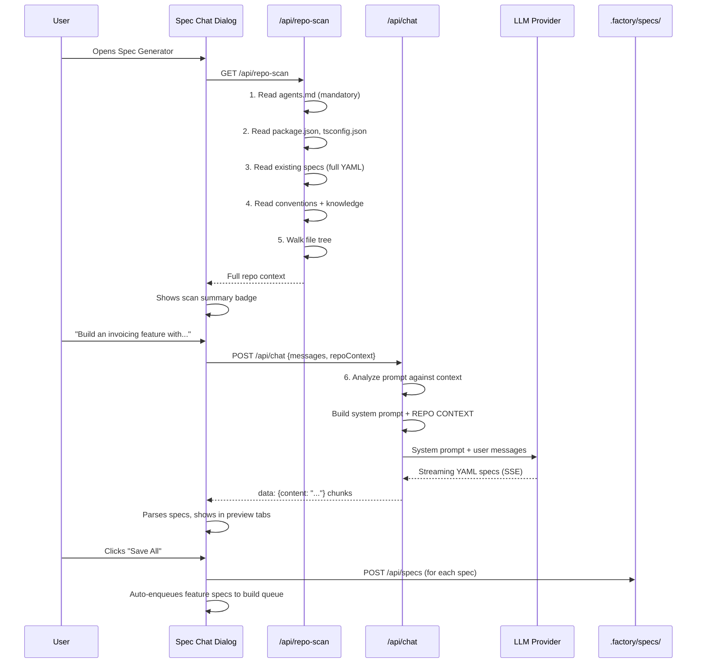

# Spec Generation — How It Works

> A living document describing how the Factory creates specs, from user prompt to saved YAML.

---

## Two Ways to Create Specs

| Method          | When to use                                                                         |
| --------------- | ----------------------------------------------------------------------------------- |
| **Manual**      | You write YAML by hand using `template.yaml` as a reference                         |
| **AI-assisted** | You describe what you want in natural language; the Spec Generator creates the YAML |

This document covers the **AI-assisted** path — the Spec Generator.

---

## The Spec Generator Flow



---

## Step-by-Step Breakdown

### 1. Dialog Opens → Repo Scan (the 5-step scan)

When the Spec Generator dialog opens, two things happen in parallel:

1. **Existing spec check** — `GET /api/specs` to see if app specs already exist. If yes, the dialog switches to "feature mode" (only generates feature specs targeting the existing app).

2. **Full repo scan** — `GET /api/repo-scan` reads the active project in this order:

| #   | Step                        | Source                                 | Purpose                                            | Required?     |
| --- | --------------------------- | -------------------------------------- | -------------------------------------------------- | ------------- |
| 1   | **agents.md**               | `AGENTS.md` / `.factory/agents.md`     | Project architecture, conventions, shared packages | ✅ Mandatory  |
| 2   | **Package analysis**        | `package.json`                         | Installed deps, dev deps, scripts                  | ✅            |
| 3   | **TypeScript config**       | `tsconfig.json`                        | Compiler options, path aliases, module system      | If exists     |
| 4   | **Existing specs**          | `.factory/specs/apps/` + `features/`   | Full YAML content of all existing specs            | If exists     |
| 5   | **Conventions & knowledge** | `factory.yaml` → rules, skills, builds | Naming rules, coding standards, build history      | If configured |
| 6   | **Stack detection**         | Derived from deps + `factory.yaml`     | Framework, PM, language, DB, cloud                 | Auto          |
| 7   | **File tree**               | Filesystem walk (max 200 files)        | Existing directory structure                       | Auto          |

A compact badge shows the results: `Repo scanned: next.js · 42 deps · 180 files · 8 existing features · ✓ agents.md`

> ⚠️ If `agents.md` is missing, a warning badge appears: `⚠️ no agents.md`. The spec generator will still work, but generated specs may not align with project conventions.

### 2. User Describes What They Want

The user types a natural language description. Quick prompts are available:

- E-commerce Store
- Blog Platform
- Task Manager
- Booking System

### 3. System Prompt Construction (Prompt Analysis)

The `/api/chat` route builds a system prompt with:

1. **Base instructions** — YAML schema, formatting rules, delimiter conventions
2. **Mode selection**:
   - **New app** → generates 1 app spec + N feature specs (phased, with dependencies)
   - **Existing app** → generates only feature specs targeting the existing app
3. **Repo context block** (injected in this order):

```
REPO CONTEXT (from scanning the actual project codebase):

=== PROJECT INSTRUCTIONS (from agents.md) ===
[Full agents.md content — architecture, conventions, shared packages]
=== END PROJECT INSTRUCTIONS ===

Detected Stack:
- Framework: next.js
- Package Manager: pnpm
- Language: typescript
- Database: firebase

Installed Dependencies (42):
next@14.2.3, react@18.3.1, firebase-admin@12.0.0, ...

Existing Files (180 total):
src/app/layout.tsx, src/lib/db.ts, ...

=== EXISTING FEATURE SPECS (8) ===
--- Authentication System ---
[Full YAML of auth spec]
--- Direct Messaging ---
[Full YAML of messaging spec]
=== END EXISTING FEATURE SPECS ===

=== PROJECT CONVENTIONS ===
[Rules from factory.yaml conventions]
=== END CONVENTIONS ===

=== BUILD KNOWLEDGE (from previous builds) ===
[Summaries of past builds]
=== END BUILD KNOWLEDGE ===

IMPORTANT CONSTRAINTS:
- Do NOT include packages already installed.
- Use the SAME framework and language detected.
- Follow agents.md conventions strictly.
- Do NOT duplicate existing feature specs.
- Align file paths with existing structure.
```

The LLM now has complete awareness of:

- **What the project IS** (agents.md)
- **What's already installed** (deps)
- **What features already exist** (full spec YAML, not just names)
- **What conventions to follow** (rules + build history)

### 4. LLM Generates Specs

The response streams back as SSE (Server-Sent Events). The LLM outputs specs in a delimited format:

````
=== APP_SPEC: booking-app.yaml ===
```yaml
appName: "Booking App"
...
````

=== END_SPEC ===

=== FEATURE_SPEC: auth-system.yaml ===

```yaml
feature:
  name: "Authentication System"
...
phase: 1
dependsOn: []
```

=== END_SPEC ===

```

### 5. UI Parses & Previews

The `spec-chat.tsx` component:
- Parses delimited spec blocks from the streamed response
- Shows each spec as a tab (app = blue, feature = green)
- Displays phase badges (P1, P2, P3) and dependency indicators
- Renders the YAML in a code preview pane

### 6. Save & Enqueue

- **Save individual** — click "Save this spec" on any tab
- **Save All** — saves all specs in phase order (app first, then P1 → P2 → P3)
- Feature specs are **auto-enqueued** to the build queue with their phase and dependency metadata
- Saved specs go to `.factory/specs/apps/` or `.factory/specs/features/`

---

## Spec Types

### App Spec

Defines a complete application. See [template.yaml](template.yaml) for the full schema.

Key sections: `appName`, `stack`, `frontend`, `layout`, `auth`, `data.tables`, `pages`, `deployment`

### Feature Spec

Defines a feature to add to an existing app.

Key sections: `feature.name`, `target.app`, `phase`, `dependsOn`, `model`, `pages`, `dependencies`

---

## Multi-Spec Decomposition

When describing a complex app, the LLM decomposes it into:

1. **1 App Spec** — the foundation (stack, layout, auth setup)
2. **N Feature Specs** — individual features, each phased:
   - **Phase 1** — Foundation (auth, core data models)
   - **Phase 2** — Core features (CRUD, business logic)
   - **Phase 3** — Polish (notifications, analytics, settings)

Features declare `dependsOn` to create a build order DAG.

---

## The Build Pipeline (What Happens After)

Once specs are saved and queued, the engine takes over. See [userguide.md](userguide.md) for the full build pipeline:

1. **Gather context** — reads spec + factory.yaml + knowledge files
2. **Validate** — checks spec structure
3. **Plan** — LLM creates a build plan (file list, architecture)
4. **Build** — LLM generates code (single-shot or module-by-module for >15 files)
5. **Test** — runs `pnpm install`, `tsc --noEmit`, linter, test runner, and runtime smoke test
6. **Iterate** — targeted fixes on broken files (up to 5 rounds)
7. **Write** — outputs to target directory
8. **Install & commit** — installs deps, commits, pushes

---

## Key Files

| File | Role |
|------|------|
| `ui/src/components/spec-chat.tsx` | Spec Generator dialog UI |
| `ui/src/app/api/chat/route.ts` | LLM-powered spec generation endpoint |
| `ui/src/app/api/repo-scan/route.ts` | Repo scanning endpoint |
| `ui/src/app/api/specs/route.ts` | Save/list spec files |
| `engine/spec.ts` | Load, validate, update specs |
| `engine/context.ts` | Gather build context from repo |
| `engine/generate.ts` | LLM build pipeline |
| `template.yaml` | App spec schema reference |

---

## Changelog

| Date | Change |
|------|--------|
| 2026-02-18 | Added agents.md (mandatory), conventions, knowledge, full spec YAML to the scan |
| 2026-02-18 | Added repo scanning — specs now reflect actual project state |
| 2026-02-18 | Initial document |
```
