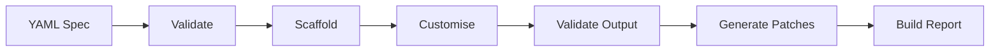
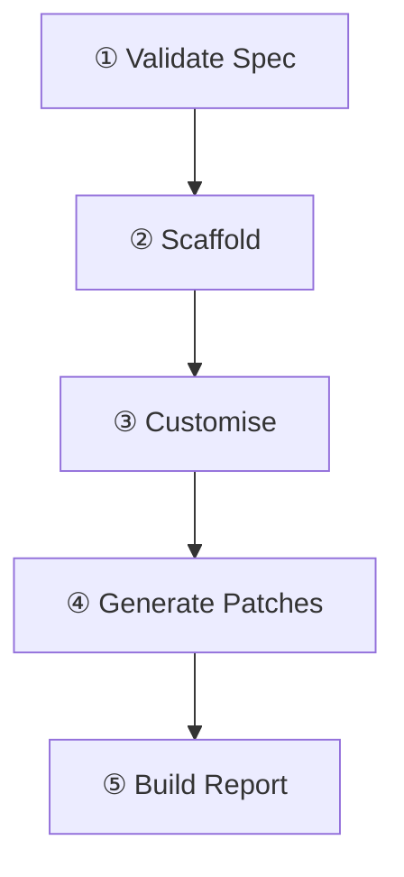
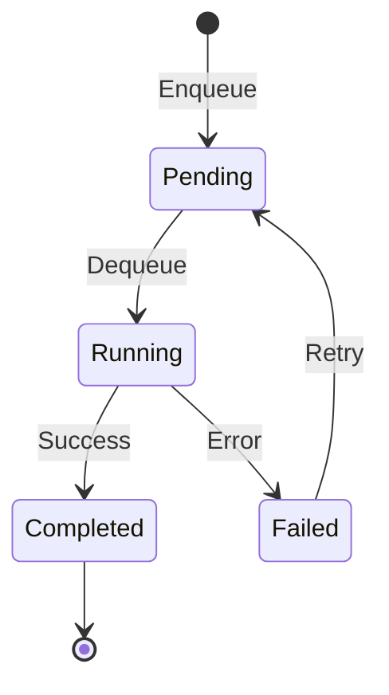

# SaveADay Factory — End-to-End User Journey

## Overview

The Factory is an autonomous code generation system. You define **what** you want in a YAML spec, and the Factory generates a complete, production-ready app or feature — scaffolded, customised, validated, patched, and documented.



---

## Phase 1: Connect Your Project

Before generating anything, you connect your target project to the Factory.

### What happens

1. **Add project** — Via the UI (Projects page) or CLI:
   ```
   factory project add /path/to/your/project
   ```
2. **Bridge init** — The Factory scans your repo and creates a `.factory/` folder:
   ```
   your-repo/
   └── .factory/
       ├── factory.yaml       ← Manifest: what the repo exposes
       └── specs/
           ├── apps/          ← Your app spec YAMLs go here
           └── features/      ← Your feature spec YAMLs go here
   ```
3. **Auto-discovery** — The bridge scans for `apps.json`, `AGENTS.md`, skill files, and the starter template (`apps/starter/`), recording paths in `factory.yaml`.

### Result

The Factory now knows your repo's structure, conventions, and templates.

---

## Phase 2: Write a Spec

### App Spec (full new app)

A YAML file describing an entire application:

```yaml
metadata:
  name: Booking
  slug: booking_app
  icon: Calendar

deployment:
  port: 3017
  region: us-central1

database:
  firestoreId: booking
  collections: [bookings, assets, professionals]

api:
  resources:
    - name: booking
      collection: bookings
      fields:
        title: { type: string, required: false }
        status: { type: string, default: "pending" }
```

### Feature Spec (add a feature to an existing app)

A YAML file describing a feature to bolt onto an existing app:

```yaml
feature:
  name: Recurring Schedule
  slug: recurring-schedule

target:
  app: booking_app

model:
  collection: recurringSchedules
  fields:
    - { name: title, type: string, required: true }
    - { name: frequency, type: string, default: "weekly" }

pages:
  - { slug: list, type: list, title: "Schedules" }
  - { slug: new, type: form, title: "New Schedule" }
  - { slug: detail, type: detail, title: "Schedule Detail" }
```

---

## Phase 3: Build — App Generation Pipeline

### Via UI

Click **Build** on any spec card, or add to the **Queue** for batch processing.

### Via CLI

```
factory build specs/apps/booking.yaml
```

### What happens (5 stages)



#### ① Validate Spec → `validate.ts`

- Checks YAML against the JSON schema
- Validates required fields: `metadata.name`, `metadata.slug`, `metadata.icon`
- Checks `deployment.port` is a valid number and not already used in the registry
- Verifies `database.firestoreId` and `database.collections` exist
- Confirms each API resource references a valid collection and has fields defined

#### ② Scaffold → `scaffold.ts`

- Copies the **starter template** (`apps/starter/`) into `output/<slug>/`
- Skips `.next`, `node_modules`, `dist`, `.env.local`
- Creates a clean, unmodified clone of the template

#### ③ Customise → `customize.ts`

Rewrites **every** template file with spec-specific values:

| File                          | What changes                                                 |
| ----------------------------- | ------------------------------------------------------------ |
| `package.json`                | Name → `@saveaday/<slug>`, port                              |
| `app.config.json`             | Full app config: name, slug, icon, brand colour, collections |
| `.env.example`                | Firestore ID, project ID, port                               |
| `next.config.ts`              | Port, transpile packages                                     |
| `middleware.ts`               | Auth routes, subdomain                                       |
| `layout.tsx`                  | App name in title metadata                                   |
| `globals.css`                 | Brand colour as CSS variable                                 |
| `page.tsx` / `HomeClient.tsx` | Dashboard with all resources listed                          |
| `src/lib/api-client.ts`       | Full CRUD API client for every resource                      |
| `src/lib/types.ts`            | TypeScript interfaces from resource fields                   |
| `deploy-to-gcp.sh`            | GCP region, project, service name                            |

#### ④ Generate Patches → `patch.ts`

Creates files that integrate the new app into the target project (placed in `output/<slug>/patches/`):

| Patch                  | Purpose                                            |
| ---------------------- | -------------------------------------------------- |
| `apps.json.patch`      | Adds the app to the project registry               |
| `app-switcher.patch`   | Adds the app to the sidebar navigation             |
| `openapi-section.yaml` | API definition for the app's endpoints             |
| `api-route.ts`         | Next.js API route handler for the new app          |
| `start-all.sh.patch`   | Adds the app to the startup script                 |
| `APPLY.md`             | Step-by-step instructions for applying all patches |

#### ⑤ Build Report → `report.ts`

Generates a Markdown report at `reports/<slug>-<timestamp>.md` with:

- App summary (name, port, region, collections, resources)
- Validation results (pass/fail per check)
- List of all generated files
- List of all patches
- Next steps checklist

---

## Phase 4: Build — Feature Generation Pipeline

### Via CLI

```
factory feature-build specs/features/recurring-schedule.yaml
```

### What happens (3 stages)

#### ① Validate Feature Spec → `feature-validate.ts`

- Checks `feature.name`, `feature.slug`, `target.app` exist
- Validates `model.collection` and `model.fields`
- Confirms each page has `slug`, `type`, `title`

#### ② Scaffold Feature → `feature-scaffold.ts`

Generates all files into `output/<app-slug>/features/<feature-slug>/`:

| Generated File                             | Purpose                                            |
| ------------------------------------------ | -------------------------------------------------- |
| `src/lib/types.ts`                         | TypeScript interface for the model                 |
| `src/lib/repositories/<slug>Repository.ts` | Firestore CRUD (get, list, create, update, delete) |
| `src/lib/actions/<slug>Actions.ts`         | Server actions wrapping the repository             |
| `src/(dashboard)/<slug>/page.tsx`          | List page (server component)                       |
| `src/(dashboard)/<slug>/ListClient.tsx`    | List page client component with table              |
| `src/(dashboard)/<slug>/new/page.tsx`      | Create form page                                   |
| `src/(dashboard)/<slug>/[id]/page.tsx`     | Detail/edit page                                   |
| `APPLY.md`                                 | Instructions for copying into the target app       |

#### ③ Feature Report

Generates a Markdown report with files generated, model summary, and apply instructions.

---

## Phase 5: Queue Processing

For batch builds, the **Queue** system manages execution:



- **Enqueue** — Add any spec (app or feature) to the queue via UI or CLI
- **Priority ordering** — Higher priority items run first, then FIFO
- **Status tracking** — `pending` → `running` → `completed` / `failed`
- **Retry** — Failed items can be retried (reset to pending)
- **SQLite storage** — Queue state persists across restarts in `factory.db`

---

## Phase 6: Review & Apply

### Output structure

```
output/booking_app/
├── package.json                  ← Ready-to-run app
├── app.config.json
├── src/
│   ├── app/
│   │   ├── (dashboard)/
│   │   ├── api/
│   │   └── ...
│   └── lib/
│       ├── api-client.ts
│       ├── types.ts
│       └── ...
├── patches/
│   ├── apps.json.patch
│   ├── app-switcher.patch
│   ├── openapi-section.yaml
│   ├── api-route.ts
│   ├── start-all.sh.patch
│   └── APPLY.md                  ← Step-by-step apply guide
└── features/
    └── recurring-schedule/       ← Feature files
```

### Apply to your project

1. Copy `output/<slug>/` → `apps/<slug>/` in your project
2. Follow `patches/APPLY.md` to merge integration patches
3. `pnpm install` → `pnpm build` → `pnpm dev`

---

## UI Dashboard

The Factory UI at `localhost:4040` provides visual control over the entire process:

| View          | What you do                                                   |
| ------------- | ------------------------------------------------------------- |
| **Dashboard** | Overview: active project, spec/queue counts                   |
| **Specs**     | View all app & feature specs, validate, build, view/edit YAML |
| **Queue**     | Manage build queue, start/stop processing, retry failed       |
| **Reports**   | Browse generated build reports                                |
| **Knowledge** | View project conventions and documentation                    |
| **Projects**  | Add/remove/switch connected repos                             |

---

_All actions produce toast notifications (sonner) for real-time feedback._
